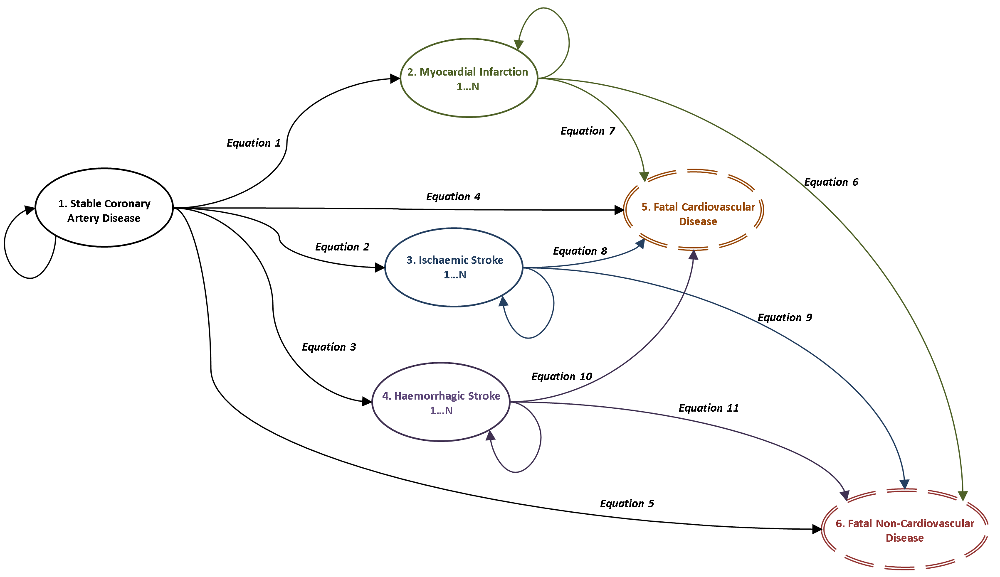

## CALIBER SCAD Model
This is a lifetime health economic model for patients with stable coronary artery disease (SCAD). The model was parameterised using data from the [CALIBER](https://www.caliberresearch.org/) dataset which comprises linked electronic health records covering, primary care, secondary care, disease registry and mortality datasets based in the English NHS. 

The model produces estimates of lifetime healthcare costs and quality adjusted life years (QALYs) for patients based on a set of baseline characteristics that determine theri risk of experiencing the modelled events. The model also produces estimates of the maximum price that the health service should be willing to pay for new treatments that reduce the risk of future events. For full details of the model please see the accompanying journal article and its technical appendices.

### Model Structure

### Model Estimation
The file [estimate_model_params.R](estimate_model_params.R) contains the survival analysis code used to estimate the 11 equations described in the model structure using a variety of alternative parametric survival models. This relies heavily on the [flexsurv](http://cran.r-project.org/web/packages/flexsurv/index.html) R package. The data required to run the survival models is sensitive and so is not available in this repository - the code is provided as documentation of the methods used. The methods used to make probabilistic draws of the cost and health related quality of life parameters are also found in this file - the input estimates for these can be found in the [input_data](input_data/) sub-directory. 

The file [diagnostics.R](diagnostics.R) uses these model and the raw patient level data to produce various diagnostic plots to decide on the best fitting model for each equation based on fit plus plausibility of extrapolated results. Again these cannot be run without the patient level data, however the resulting diagnostic plots are available in the technical appendix to the accompanying journal article.

### Markov Model
Once the model has been estimated we combine the 11 risk equations for a given set of patient characteristics using a [competing risks framework](http://onlinelibrary.wiley.com/doi/10.1002/sim.2712/abstract) in the file [competing_risks.R](competing_risks.R).

These competing risks are then converted into transition probabilities and used to create and apply a transition matrix along with associated cost and health related quality of life matrices in the file [markov_model.R](markov_model.R). The model loads its key parameters from the RData file [CALIBER_SCAD_params.RData](CALIBER_SCAD_params.RData). 

Patients profiles to run the model for can either be taken from this saved data file - such as the average patients characeristics for patients in each risk decile by setting the patient_group parameter to "deciles", be run for hypothical patients in each of these deciles by setting the patient_group parameter to "clinical" or be manually specified in a CSV file by setting the patient_group parameter to "manual" and inputting patient characetristics in the form used in the example file [input_data/pegasus_odyssey_patients.csv](input_data/pegasus_odyssey_patients.csv). A description of the meaning of the parameters and their units can be found in the accompanying journal article.

### Running the Model
The model is run using the file [run_model.R](run_model.R). The file is expected to be run from the command line and takes 4 parameters:

1. patient - this is an index into the saved patient list or supplied CSV file to indicate which patient to run the model for e.g. when running the model for patient_group="deciles" this will specify which decile to run the model for
2. iteration - this is the PSA iteration that the model should be run for - there are 10,000 saved probabilistic draws from the model parameters that can be utilised for this purpose. Setting this number to -1 runs the model deterministically.
3. patient group - this is one of "deciles", "clinical" or "manual" as described in the markov model section above
4. patient file - this is only required where patient groups specified as "manual" and indicates the location of the CSV file containing the patient characteristics

The model was run repeatedly on a [Sun Grid Engine](http://en.wikipedia.org/wiki/Oracle_Grid_Engine) cluster hosted by the [N8 HPC partnership](http://n8hpc.org.uk/). The various bash scripts (*.sh) and job scripts (*.job) are used to run the model probabilistically and aggregate the results for various different patient profiles using files: [run_model.R](run_model.R), [patient_results.R](patient_results.R) and [format_results.R](format_results.R). These files expect sub-directories logs, output, output/model_results and output/model_summary to exist to save model output to.

### Processing Model Results
The model results are converted into the key results tables and plots used in the accompanying journal article by the files [group_results.R](group_results.R) which is expected to be run from the command line and takes 3 parameters:

1. number_patients - the number of different patients the model was run for
2. patient group - this is one of "deciles", "clinical" or "manual" that the model was run for
3. patient file - this is only required where patient groups specified as "manual" and indicates the location of the CSV file containing the patient characteristics

### Accompanying Journal Article
This model was used to produce the key results described in the journal article titled "Using electronic health records to predict costs and outcomes in chronic disease using the example of stable coronary artery disease". A link to the article will be published here once it is published.
